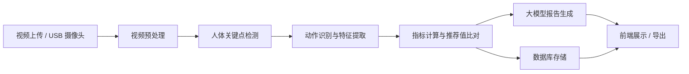

# 视觉篮球教练系统设计方案

## 1. 项目目标

本项目面向篮球训练场景，构建一套基于 Python 的视觉篮球教练系统，用于完成运动员注册建档、身体信息存档与变更记录、视频上传分析、USB 摄像头实时监测、动作识别、命中率统计、训练评估以及大模型报告生成。

系统的核心目标不是单纯识别视频内容，而是形成“采集 - 分析 - 评估 - 建议 - 复盘”的训练闭环，帮助教练持续优化训练方案，帮助运动员提升技术表现并降低训练风险。

## 2. 需求范围

### 2.1 运动员管理

- 运动员注册、登录与档案创建。
- 记录基础信息：姓名、性别、年龄、位置、惯用手、身高、体重、臂展、体脂率等。
- 记录身体信息变化历史，支持按时间查看趋势。
- 支持训练阶段、伤病情况、备注信息维护。

### 2.2 数据采集

- 支持上传训练视频进行离线分析。
- 支持 USB 摄像头实时采集画面。
- 支持训练会话绑定运动员、时间、训练类型和场地信息。

### 2.3 视觉分析

- 识别运动员动作类型，例如投篮、运球、传球、起跳、落地、防守姿态等。
- 提取关键技术指标，例如出手角度、出手时机、身体稳定性、命中率、动作一致性等。
- 对动作结果与推荐值进行比对，输出偏差结论。

### 2.4 报告生成

- 基于结构化分析结果生成训练报告。
- 输出训练问题、改进建议、风险提示和下一步训练方向。
- 支持日、周、月级别统计与汇总。

## 3. 总体架构

建议采用前后端分离架构，后端以 Python 为核心实现。



### 3.1 分层设计

- 采集层：负责视频上传、摄像头流读取和训练会话管理。
- 视觉层：负责关键点检测、动作识别、篮球与篮筐检测。
- 业务层：负责运动员档案、训练记录、推荐值配置、告警规则。
- 报告层：负责自动总结、训练建议生成和历史分析。
- 存储层：负责保存原始视频、结构化结果、报告和版本记录。

## 4. 技术选型

### 4.1 后端

- FastAPI：接口服务与实时数据接口。
- SQLAlchemy 或 SQLModel：数据库 ORM。
- Pydantic：请求响应校验。
- PostgreSQL：核心业务数据存储。
- Redis：缓存、实时状态和任务队列。
- Celery 或 RQ：异步视频分析任务。

### 4.2 计算机视觉与算法

- OpenCV：视频读取、图像处理、帧抽取。
- MediaPipe 或 OpenPose：人体关键点检测。
- Ultralytics YOLO：篮球、篮筐、球员区域检测。
- PyTorch：动作分类模型训练与推理。
- NumPy、Pandas、SciPy：特征分析和统计计算。

### 4.3 前端

- React 或 Vue：训练看板、管理台与实时监控页面。
- WebSocket：实时推送分析结果。

### 4.4 大模型

- 用于生成训练总结、问题定位和建议文本。
- 输入应以结构化分析结果为主，避免直接将原始视频分析责任交给大模型。

## 5. 核心业务流程

### 5.1 离线分析流程

1. 上传训练视频。
2. 绑定运动员与训练会话。
3. 后台抽帧并提取关键点。
4. 识别动作片段并计算指标。
5. 与推荐值进行比对。
6. 生成结构化结果与训练报告。
7. 保存报告版本并展示给教练与运动员。

### 5.2 实时监测流程

1. USB 摄像头接入系统。
2. 采集线程持续获取视频帧。
3. 推理线程执行关键点检测与动作识别。
4. 规则引擎计算当前动作评分和告警状态。
5. WebSocket 推送实时结果到前端。
6. 训练结束后汇总会话数据并生成报告。

## 6. 数据库设计建议

### 6.1 运动员表 athlete

存储运动员基础身份和当前状态。

字段建议：

- id
- name
- gender
- age
- position
- dominant_hand
- created_at
- updated_at

### 6.2 身体信息历史表 athlete_body_history

记录身高、体重、臂展、体脂率等随时间变化的数据。

字段建议：

- id
- athlete_id
- height
- weight
- wingspan
- body_fat
- measurement_date

### 6.3 训练会话表 training_session

一条记录对应一次训练或一次视频分析任务。

字段建议：

- id
- athlete_id
- session_type
- source_type
- start_time
- end_time
- status
- notes

### 6.4 视频资源表 media_asset

保存上传视频或摄像头录制结果。

字段建议：

- id
- session_id
- file_path
- source_type
- fps
- resolution
- duration

### 6.5 动作识别结果表 action_result

记录动作类别、时间片段和置信度。

字段建议：

- id
- session_id
- action_type
- start_frame
- end_frame
- confidence

### 6.6 技术指标表 performance_metric

记录分析得到的核心训练指标。

字段建议：

- id
- session_id
- shot_angle
- release_time
- jump_height
- shot_accuracy
- body_stability
- symmetry_score

### 6.7 推荐值配置表 recommendation_rule

保存不同年龄段、位置和训练阶段的目标区间。

字段建议：

- id
- rule_name
- age_group
- position
- metric_name
- min_value
- max_value
- target_value

### 6.8 报告表 report

保存大模型生成的最终报告。

字段建议：

- id
- session_id
- report_text
- summary_json
- model_name
- generated_at

## 7. 动作识别设计

建议分三层实现，先易后难。

### 7.1 第一层：人体关键点提取

使用 MediaPipe 或 OpenPose 获取肩、肘、腕、髋、膝、踝等关键点坐标，为动作分析提供基础数据。

### 7.2 第二层：几何特征计算

根据关键点计算角度、速度、重心变化和动作轨迹，例如：

- 投篮出手角度
- 肘部伸展角度
- 起跳时机
- 身体前倾程度
- 左右平衡偏差

### 7.3 第三层：时序动作分类

将连续帧的关键点序列输入时序模型，识别动作类型。可选模型包括：

- LSTM
- GRU
- TCN
- Transformer 时序模型

这种分层方案可保证系统具备较强可解释性，并便于后续迭代升级。

## 8. 命中率与训练指标

系统中的命中率建议拆分为多个维度，而不是只记录总命中数。

### 8.1 主要指标

- 总投篮次数
- 命中次数
- 命中率
- 热区命中率
- 连续命中稳定性
- 动作一致性
- 偏左、偏右、过短、过长等失误类型

### 8.2 指标用途

- 用于训练前后效果比较。
- 用于评估某一动作模式是否稳定。
- 用于识别个体技术短板。
- 用于生成个性化训练建议。

## 9. 推荐值体系

推荐值不应采用统一标准，而应根据个体差异进行分层配置。

### 9.1 分层维度

- 年龄段
- 位置类型
- 左右手习惯
- 训练阶段
- 伤病恢复状态
- 个人历史均值

### 9.2 推荐值来源

- 教练经验配置
- 历史优秀样本统计
- 专家知识库
- 个体历史基线

## 10. 大模型报告设计

建议大模型只处理结构化分析结果，不直接分析原始视频。

### 10.1 输入内容

- 本次训练摘要
- 动作识别结果
- 技术指标统计
- 与推荐值的偏差
- 历史趋势
- 告警和异常事件

### 10.2 输出内容

- 本次训练结论
- 主要问题
- 训练建议
- 风险提示
- 下一步训练计划

### 10.3 控制原则

- 以规则引擎为基础，大模型负责自然语言总结。
- 关键指标必须可追溯。
- 报告输出应支持版本留存。

## 11. 目录结构建议

```text
app/
  api/
  analysis/
  config/
  models/
  reports/
  schemas/
  services/
  tasks/
  video/
  vision/
tests/
```

### 11.1 各目录职责

- api：接口路由。
- models：数据库模型。
- schemas：请求与响应结构。
- services：业务逻辑。
- video：视频输入与采集。
- vision：视觉分析与识别。
- analysis：指标计算与评分。
- reports：报告生成。
- tasks：异步任务。

## 12. 开发阶段建议

### 12.1 第一阶段：MVP

- 运动员注册和档案维护。
- 视频上传与训练会话管理。
- 离线姿态检测与基础动作统计。
- 简单评分和推荐值比对。
- 报告生成与历史记录查看。

### 12.2 第二阶段：实时分析

- 接入 USB 摄像头。
- 实现实时动作识别和指标刷新。
- 建立前端实时监控页面。

### 12.3 第三阶段：智能优化

- 加入个体化推荐值。
- 引入趋势分析与长期表现比较。
- 训练动作模型迭代优化。

### 12.4 第四阶段：产品化

- 权限管理。
- 多教练协作。
- 训练计划管理。
- 移动端支持。

## 13. 关键难点

### 13.1 动作识别精度

篮球动作受遮挡、镜头角度和光照影响明显，需要先控制采集场景，再逐步提升模型精度。

### 13.2 命中率判断

如果要准确判断进球，最好结合球轨迹和篮筐检测，而不是只依赖人体姿态。

### 13.3 实时性能

实时推理需要控制帧率并采用异步任务，避免前端卡顿。

### 13.4 大模型可信度

报告必须基于结构化数据生成，并保留输出依据，避免出现不可解释建议。

## 14. 建议的最小可行版本

如果要尽快启动开发，建议先实现以下内容：

1. 运动员注册和档案管理。
2. 视频上传和训练会话记录。
3. 离线姿态检测与动作识别。
4. 指标统计与推荐值对比。
5. 大模型自动报告生成。

在 MVP 稳定后，再扩展 USB 摄像头实时分析、投篮轨迹识别和个性化训练建议。

## 15. 下一步实施建议

如果你准备继续推进，下一步可以直接拆成下面三种文档之一：

1. 数据库表结构详细设计。
2. FastAPI 项目目录与接口定义。
3. MVP 开发计划与任务拆分。

## 16. Docker 开发环境管理

建议用 Docker 统一开发环境，保证本地、团队与部署环境一致。开发阶段推荐使用 docker-compose，拆分为 API、异步任务、数据库、缓存和对象存储等服务。

### 16.1 基本服务建议

- api：FastAPI 服务，挂载源码以支持热重载。
- worker：异步分析任务进程，执行视频分析、模型推理。
- db：PostgreSQL。
- redis：缓存、任务队列。
- object-storage：本地开发可用 MinIO，保存视频与中间结果。

### 16.2 docker-compose 示例

```yaml
services:
  api:
    build: .
    command: uvicorn app.main:app --host 0.0.0.0 --port 8000 --reload
    volumes:
      - ./:/app
    ports:
      - "8000:8000"
    env_file:
      - .env
    depends_on:
      - db
      - redis

  worker:
    build: .
    command: celery -A app.tasks worker --loglevel=info
    volumes:
      - ./:/app
    env_file:
      - .env
    depends_on:
      - db
      - redis

  db:
    image: postgres:15
    environment:
      POSTGRES_DB: sport_vision
      POSTGRES_USER: sport
      POSTGRES_PASSWORD: sport
    ports:
      - "5432:5432"

  redis:
    image: redis:7
    ports:
      - "6379:6379"

  object-storage:
    image: minio/minio
    command: server /data --console-address ":9001"
    environment:
      MINIO_ROOT_USER: minio
      MINIO_ROOT_PASSWORD: minio123
    ports:
      - "9000:9000"
      - "9001:9001"
```

### 16.3 GPU 与摄像头注意事项

- 如果需要 GPU 推理，可使用带 CUDA 的基础镜像并启用 NVIDIA 容器运行时。
- 在 Windows 上，USB 摄像头直接映射进 Docker 容器的稳定性有限，建议采用以下方案之一：
  - 摄像头采集进程在宿主机运行，通过 RTSP/HTTP 推流给容器。
  - 采集端与推理端拆分，采集端写入共享目录或对象存储。

## 17. 图像识别技术方案与进球判定

### 17.1 视觉技术方案

- 人体关键点：MediaPipe 或 OpenPose，用于姿态与动作指标。
- 目标检测：YOLO 系列用于篮球、篮筐、球员检测。
- 动作识别：关键点时序模型（LSTM/TCN/Transformer）。
- 事件判定：基于轨迹与规则的进球判定与投篮事件定位。

### 17.2 是否能识别有效进球

在单摄像头场景下可以识别有效进球，但需要满足一定条件：

- 镜头角度需清晰覆盖篮筐与球的完整轨迹。
- 画面清晰度和光照稳定。
- 帧率建议不低于 25 FPS，理想为 30 FPS 以上。

可行的进球判定思路如下：

- 检测篮筐并建立筐口椭圆区域。
- 追踪篮球轨迹，判断球心是否从筐口上方进入并从下方离开。
- 结合球的垂直速度方向变化与时间窗口，过滤擦筐、反弹假阳性。
- 可辅以篮网形变检测或篮筐下方区域事件确认，提升准确率。

如果追求高精度，建议增加第二个摄像头或使用深度信息，以减少遮挡与透视误差。

## 18. 帧率兼容与实时性能

### 18.1 上传视频帧率兼容

- 支持多种帧率输入，分析前统一转为目标帧率。
- 若视频为可变帧率，建议先用 FFmpeg 转为恒定帧率。
- 采集时保留原始时间戳，避免帧率转换引入节奏误差。

### 18.2 实时采集帧率策略

- 实时推理可采用降帧策略，例如 15 到 20 FPS 进行推理。
- 关键片段可临时提升采样率，保证动作细节准确性。
- 低于 10 FPS 会显著影响进球判定与投篮动作细节。

## 19. 是否需要跟踪与滤波算法

### 19.1 跟踪必要性

- 篮球属于快速目标，强烈建议使用跟踪算法。
- 多人场景可使用 ByteTrack 或 SORT 进行球员目标关联。
- 球跟踪可结合卡尔曼滤波实现轨迹平滑与遮挡补偿。

### 19.2 滤波与平滑建议

- 关键点抖动可用 One Euro Filter 或滑动平均平滑处理。
- 投篮轨迹可用 RANSAC 拟合抛物线去除噪声点。
- 对关键指标建议先平滑再计算评分，减少偶发帧干扰。

## 20. 进球判定算法伪代码与参数配置建议

### 20.1 进球判定伪代码

```text
Inputs:
  frames                # video frames or stream
  hoop_detector          # detects hoop bbox
  ball_detector          # detects ball bbox
  tracker                # track ball across frames
  params                 # thresholds and time windows

State:
  hoop_region            # ellipse or polygon for hoop rim
  ball_tracks            # list of ball track states
  shot_events            # detected shot attempts

for each frame in frames:
  hoop_bbox = hoop_detector(frame)
  if hoop_bbox is valid:
    hoop_region = fit_ellipse(hoop_bbox)   # stable rim region

  ball_dets = ball_detector(frame)
  ball_tracks = tracker.update(ball_dets)

  for track in ball_tracks:
    if track.length < params.min_track_len:
      continue

    if not is_in_roi(track.last_pos, hoop_region.expand(params.rim_margin)):
      continue

    # detect entry: ball center crosses above to inside rim
    if crosses_rim_plane(track, hoop_region, direction="down"):
      mark_event_candidate(track, frame.index)

    # confirm exit: ball center exits below rim within time window
    if is_candidate(track) and exits_rim_below(track, hoop_region):
      if within_frames(track, params.min_frames_between, params.max_frames_between):
        if vertical_velocity(track) < -params.min_downward_speed:
          if not hits_backboard_first(track, params.backboard_zone):
            shot_events.append(confirm_goal(track))
          else:
            shot_events.append(confirm_goal(track))  # optional if backboard allowed
        else:
          discard_candidate(track)  # bounce or noise

Output:
  shot_events            # goals + timestamps + confidence
```

### 20.2 参数配置建议

- `min_track_len`: 8-12 帧，避免短轨迹误判。
- `rim_margin`: 3-8 像素或按篮筐半径的 5% 到 10% 扩展。
- `min_frames_between`: 3-6 帧，过滤虚假穿越。
- `max_frames_between`: 18-30 帧，避免过长时间误判。
- `min_downward_speed`: 1.5-3.0 像素/帧或按真实尺度折算。
- `ball_detector_conf`: 0.35-0.55，保证召回率。
- `hoop_detector_conf`: 0.45-0.65，保证稳定篮筐定位。
- `backboard_zone`: 可选，若允许打板进球，需保留规则。

注：上述阈值需与画面分辨率、镜头距离和帧率共同标定，建议用小样本标注视频做网格搜索或 Bayesian 调参。

### 20.3 进球类型拆分建议

建议将进球类型拆成“入筐方式”与“得分价值”两条维度，便于训练统计与可视化。

入筐方式（可识别）

- 空心球（Swish）：球轨迹直接穿过篮筐中心区，无篮筐或篮板接触。
- 打板进球（Bank）：球轨迹先触篮板，再进入篮筐。
- 碰框进球（Rim-in）：球与篮筐接触后进入，可细分为前框、后框、侧框。
- 滚筐进球（Roll-in）：球在篮筐上沿滚动后落入，通常伴随多帧接触。
- 补篮/点进（Tip-in/Putback）：球在篮下近距离被二次触球后入筐，需结合球员手部关键点与球轨迹。

得分价值（按场地规则）

- 罚球命中：来自罚球线区域的投篮事件。
- 两分命中：在三分线内投篮命中。
- 三分命中：在三分线外投篮命中。

判定依据建议

- 入筐方式主要依据球与篮筐/篮板的接触顺序与持续帧数。
- 得分价值依据出手点与场地区域划分，需先做场地标定与三分线拟合。

### 20.4 进球类型细化判定方案

建议先统一定位“投篮事件窗口”，再在窗口内根据接触顺序和持续帧数细化进球类型。

投篮事件窗口

- `release_ts`: 手部与球分离时刻，手球距离由小于阈值变大。
- `rim_entry_ts`: 球心从筐口上方进入筐口区域的时刻。
- `rim_exit_ts`: 球心从筐口下方离开筐口区域的时刻。
- `event_window`: [release_ts - 0.5s, rim_exit_ts + 0.5s]。

接触判定与规则

- 篮板接触：球轨迹进入篮板区域并出现明显速度反向或加速度突变。
- 篮筐接触：球心到筐口圆的距离小于阈值且切向速度发生突变。
- 滚筐特征：球心在筐口圆附近停留超过 `roll_min_frames` 帧，且出现多次接触。
- 补篮/点进：在 rim_entry_ts 前 0.2s 内出现手球接触事件，且球员位于篮下近距离区域。

类型判定顺序建议（避免冲突）

1. 补篮/点进：满足近篮区域 + 手球接触 + 立即入筐。
2. 打板进球：篮板接触发生在 rim_entry_ts 之前。
3. 滚筐进球：满足滚筐特征。
4. 碰框进球：篮筐接触发生在 rim_entry_ts 之前或进入后短时内。
5. 空心球：无篮板接触、无篮筐接触，直接穿过筐口。

### 20.5 进球时间点标注与人工复核

为支持后续人工判断，建议在每次进球事件中记录关键时间点与关键帧索引。

建议记录的时间点

- `release_ts` / `release_frame`: 出手时刻。
- `apex_ts` / `apex_frame`: 轨迹最高点时刻。
- `rim_entry_ts` / `rim_entry_frame`: 进入筐口时刻。
- `rim_exit_ts` / `rim_exit_frame`: 离开筐口时刻。
- `backboard_contact_ts` / `backboard_contact_frame`: 触板时刻（可选）。
- `rim_contact_start_ts` / `rim_contact_end_ts`: 触框起止时刻（可选）。
- `hand_contact_ts`: 补篮/点进所需的触球时刻（可选）。

人工复核素材建议

- 自动截取事件片段：`clip_start = release_ts - 1.0s`，`clip_end = rim_exit_ts + 1.0s`。
- 在片段中标注关键帧与类型预测结果，提供一键纠错入口。
- 复核结果保存为 `goal_type_reviewed`、`is_goal_reviewed`、`reviewer_id`、`reviewed_at`。

### 20.6 具体阈值与标定流程

关键阈值建议（需随分辨率与视角调整）

- `rim_radius_px`: 篮筐半径像素值，建议以 30 帧滑动窗口取中位数。
- `rim_contact_dist`: 0.08 到 0.15 * `rim_radius_px`，判定触框距离阈值。
- `backboard_zone_depth`: 0.12 到 0.25 * `rim_radius_px`，篮板判定区域深度。
- `velocity_jump`: 2.0 到 4.0 像素/帧，加速度突变阈值。
- `roll_min_frames`: 6 到 12 帧，滚筐停留最短帧数。
- `hand_ball_dist`: 0.6 到 1.0 * 手掌关键点置信区间，补篮触球判定。
- `release_gap_frames`: 2 到 5 帧，手球分离最小帧数。
- `entry_exit_gap_frames`: 3 到 8 帧，入筐到出筐的时间窗口。

标定流程建议

1. 相机与场地标定
  - 使用场地线或已知尺寸标记进行单应性标定，建立像素到场地坐标映射。
  - 使用篮筐内径 0.45m 作为尺度基准，估算 `rim_radius_px`。

2. 篮筐与篮板稳定定位
  - 在静态或缓慢移动镜头下收集 200-500 帧，计算篮筐区域中位数位置。
  - 若镜头抖动明显，采用滑动窗口平滑篮筐位置。

3. 轨迹与速度尺度调整
  - 记录 20-50 个投篮片段，计算球速度均值与标准差。
  - 将 `velocity_jump` 与 `min_downward_speed` 对齐到 $\mu \pm 2\sigma$ 范围。

4. 事件阈值调优
  - 用 30-100 个手工标注样本做网格搜索。
  - 目标指标以精确率优先，召回率为次要指标。

5. 多机位一致性校验（可选）
  - 若有双机位，采用交叉验证检查进球时间点一致性。

### 20.7 人工复核界面交互字段与审核流程

建议界面字段

- 事件列表：时间戳、运动员、进球类型预测、置信度、得分价值。
- 视频片段：可播放 2 倍慢放、逐帧浏览。
- 时间点标注：release、apex、rim_entry、rim_exit、contact 等帧索引。
- 规则证据：触框/触板/触球提示与触发条件。
- 纠错表单：进球类型下拉框、得分价值下拉框、是否有效进球切换。
- 备注与标签：异常原因、遮挡、误检等标签。
- 审核信息：审核人、审核时间、审核结论。

审核流程建议

1. 初审：系统自动生成事件 + 置信度 + 规则证据。
2. 复核：教练或审核员查看片段并确认或更正。
3. 质检：低置信度或冲突事件进入二次审核队列。
4. 归档：保存最终结论与审计记录，更新训练统计。

### 20.8 进球类型冲突的置信度融合策略

冲突来源通常是多种证据同时成立，例如“触框后入筐”和“打板后入筐”。建议采用分层规则 + 置信度融合的策略。

融合思路

- 规则优先级：补篮/点进 > 打板进球 > 滚筐进球 > 碰框进球 > 空心球。
- 证据置信度：基于触发条件的稳定性打分，例如触板时速度反向幅度、触框持续帧数。
- 模型置信度：动作分类或事件检测模型输出。

融合评分示例

```text
final_score = 0.6 * rule_score + 0.4 * model_score
```

冲突处理建议

- 若最高分与次高分差值小于 0.1，标记为“待复核”。
- 若规则优先级更高但置信度明显更低，记录为“低置信度优先级覆盖”。
- 输出 `goal_type_candidates` 列表，保留前 3 个候选及其分数，便于人工复核。

### 20.9 标定与校准参考

标定数据模型、标定流程与校准频率等内容见 [标定与校准方案.md](标定与校准方案.md)。

附录内容摘要

- FIBA/NBA 标准场地关键点坐标模板。
- 标定工具交互步骤与点位清单。
- 平面法向量与相机高度估计说明。
- 联合标定点位清单与一致性约束模板。
- 联合标定 JSON 输出字段示例。

## 21. 实时推理线程/进程划分与性能预算

### 21.1 线程/进程划分

建议采用“采集与推理解耦”的结构，核心目标是保证采集不阻塞推理。

- 进程 A：采集与解码
  - 从 USB 摄像头读取帧，写入环形缓冲队列。
- 进程 B：推理与跟踪
  - 对采样帧进行检测、关键点与跟踪。
  - 输出动作类型、投篮事件、球轨迹。
- 进程 C：评估与告警
  - 计算指标、推荐值比对、异常告警。
- 线程 D：可视化与输出
  - 叠加骨架、轨迹和评分，推送 WebSocket。

推荐使用 multiprocessing.Queue 或 ZeroMQ 进行进程通信，缓冲深度建议 3 到 8 帧，避免丢帧与延迟堆积。

### 21.2 性能预算建议

实时推理通常以 15 到 20 FPS 为目标，预算如下：

- 20 FPS: 单帧预算约 50 ms
- 15 FPS: 单帧预算约 66 ms

推荐预算拆分（GPU 推理）：

- 解码与预处理：5-8 ms
- 目标检测（球/篮筐/球员）：18-28 ms
- 姿态关键点：12-22 ms
- 跟踪与滤波：2-5 ms
- 事件判定与指标计算：2-4 ms
- 可视化与编码：5-10 ms

若仅 CPU 推理，目标检测与姿态估计会显著变慢，建议降到 8 到 12 FPS，并开启降帧、ROI 裁剪与模型轻量化。

### 21.3 性能稳定策略

- 动态降帧：负载高时下调推理帧率，优先保证稳定输出。
- ROI 裁剪：优先分析球与篮筐附近区域。
- 模型轻量化：使用半精度和 TensorRT 加速。
- 关键片段升级：检测到投篮事件时临时提升采样率。
